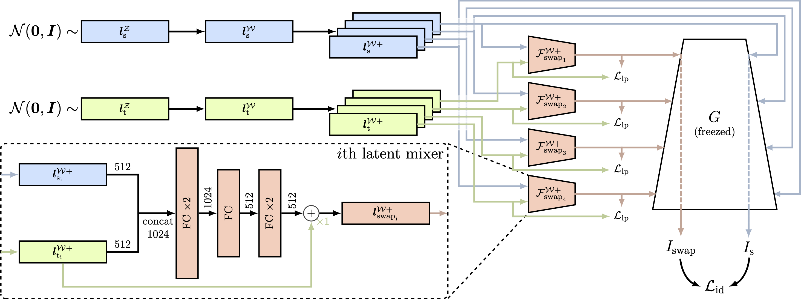
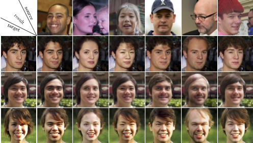

# LatentSwap: An Efficient Latent Code Mapping Framework for Face Swapping
## Notes
* This code was primarily written in the summer of 2023.
* The code was not tested before committing.
* Contributions and pull requests are welcome.

## Table of Contents
1. [Introduction](#introduction)
2. [Requirements and Installation](#requirements-and-installation)
3. [Training](#training)
4. [Inference](#inference)
5. [Results](#results)
6. [Evaluation and Performance Metrics](#evaluation-and-performance-metrics)
7. [Citation](#citation)
8. [License](#license)
9. [Code Author](#code-author)

## Introduction

Official Implementation for [LatentSwap:An Efficient Latent Code Mapping Framework for Face Swapping](https://arxiv.org/abs/2402.18351).


## Requirements and Installation

### Run Docker Container

```
docker build . -t latentswap:latest

docker run -it --ipc host --gpus "device=0" -v /PATH_TO_SAVE:/DATA --name latentswap latentswap:latest
```

### Pre-Trained Model for StyleGAN2
Download checkpoint from [official checkpoint](https://nvlabs-fi-cdn.nvidia.com/stylegan2-ada-pytorch/pretrained/ffhq.pkl) and copy it to '/workspace/' in docker container.
```
docker cp ffhq.pkl latentswap:/workspace/
```

### Pre-Trained Model for Smooth Identity Embedder 
Download checkpoint with [this](https://drive.google.com/file/d/1Wumi0CiBVkdPr6qukAHD9f3mSDOeOLo_/view?usp=sharing) link and copy it to '/workspace' in docker container.

```
docker cp epoch=5-step=109999.ckpt latentswap:/workspace/
```

### Pre-Trained Model for Deep3DFace PyTorch

Follow the guideline in [Prepare prerequisite models](https://github.com/sicxu/Deep3DFaceRecon_pytorch#prepare-prerequisite-models) at `/workspace/model/Deep3DFaceRecon_pytorch/` folder.

```
docker cp latentswap:/workspace/model/Deep3DFaceRecon_pytorch/BMF/

docker cp epoch_20.pth latentswap:/workspace/model/Deep3DFaceRecon_pytorch/checkpoints
```


## Training

```
python latentswap_trainer.py --help
```

## Inference

### Pre-trained Model
Download the pre-trained model from this [link](https://drive.google.com/file/d/1YsGy856Q1bqFoHhdascoNQrbOCcLK4fP/view?usp=sharing).

```
docker cp epoch=39-step=200000.ckpt latentswap:/workspace/
```

### Inference with Target and Source Images

```
python pti_inversion_inference.py --model_checkpoint_path 'epoch=39-step=200000.ckpt' --target_image_path TARGET_PATH --source_image_path SOURCE_PATH
```

Ensure all images follow the preprocessing steps of [FFHQ](https://github.com/NVlabs/ffhq-dataset).


## Results
### FFHQ Test Set Results



## Evaluation and Performance Metrics
### Metric comparisons of our model on the FaceForensics++ dataset

| Model      | ID ↑   | Expression ↓ | Pose ↓ | Params ↓ |
|------------|--------|--------------|--------|----------|
| DeepFakes  | 88.39  | 0.1705       | 13.38  | Unknown  |
| FaceShifter| 90.68  | 0.1223       | 7.65   | 250M     |
| SimSwap    | 89.73  | 0.0879       | 5.82   | 120M     |
| HifiFace   | 98.48  | NA           | 7.89   | 244M     |
| MegaFS     | 90.83  | 0.1348       | 7.92   | 338M     |
| RAFSwap    | 96.70  | 0.1312       | 7.59   | Unknown  |
| InfoSwap   | **99.67** | 0.1427    | 9.07   | 251M     |
| **Ours**   | 93.36  | **0.0673**   | **4.06** | **87M** |

**Note:** Our model achieves comparable performances to other face swapping models for ID and better performance for all other metrics.

## Citation
```
Choi, Changho, et al. "LatentSwap: An Efficient Latent Code Mapping Framework for Face Swapping." arXiv preprint arXiv:2402.18351 (2024).
```

## License
[MIT License](https://opensource.org/licenses/MIT)

## Code Author
[Changho Choi](https://github.com/usingcolor) @ Korea Univ. (changho9808@gmail.com)
